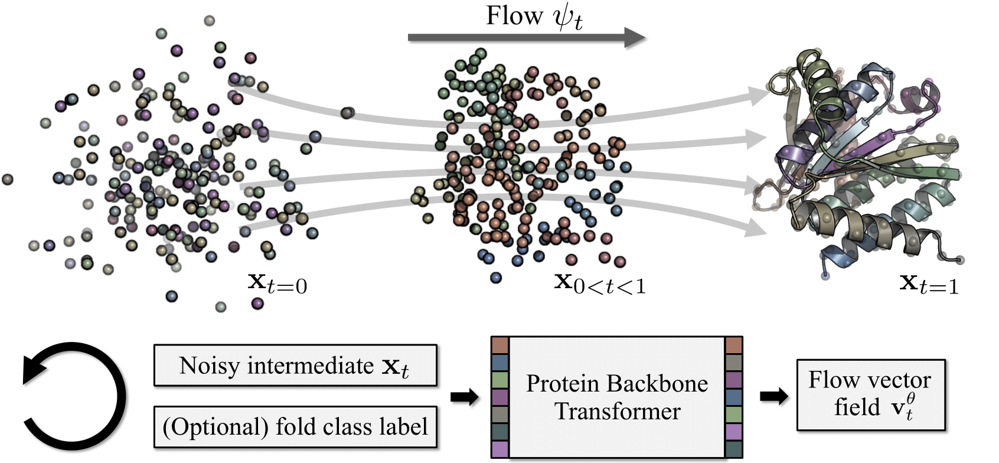

# Proteina: Scaling Flow-based Protein Structure Generative Models (ICLR 2025 Oral Paper)

<div align="center">
  <a href="https://tomasgeffner.github.io/" target="_blank">Tomas&nbsp;Geffner<sup>*</sup></a> &emsp; <b>&middot;</b> &emsp;
  <a href="https://kdidi.netlify.app/" target="_blank">Kieran&nbsp;Didi<sup>*</sup></a> &emsp; <b>&middot;</b> &emsp;
  <a href="https://oxer11.github.io/" target="_blank">Zuobai&nbsp;Zhang<sup>*</sup></a> &emsp; <b>&middot;</b> &emsp;
  <a href="https://scholar.google.com/citations?user=KBn52kYAAAAJ&hl=en" target="_blank">Danny&nbsp;Reidenbach</a>
  <br>
  <a href="https://scholar.google.com/citations?hl=en&user=wGjVFHIAAAAJ&view_op=list_works&sortby=pubdate" target="_blank">Zhonglin&nbsp;Cao</a> &emsp; <b>&middot;</b> &emsp;
  <a href="https://people.csail.mit.edu/jyim/" target="_blank">Jason&nbsp;Yim</a> &emsp; <b>&middot;</b> &emsp;
  <a href="https://mariogeiger.ch/" target="_blank">Mario&nbsp;Geiger</a> &emsp; <b>&middot;</b> &emsp;
  <a href="https://christian.dallago.us/" target="_blank">Christian&nbsp;Dallago</a>
  <br>
  <a href="https://scholar.google.ch/citations?hl=en&user=LUXL9FoAAAAJ" target="_blank">Emine&nbsp;Kucukbenli</a> &emsp; <b>&middot;</b> &emsp;
  <a href="http://latentspace.cc/" target="_blank">Arash&nbsp;Vahdat</a> &emsp; <b>&middot;</b> &emsp;
  <a href="https://karstenkreis.github.io/" target="_blank">Karsten&nbsp;Kreis<sup>*</sup></a>
  <br> <br>
  <a href="https://openreview.net/forum?id=TVQLu34bdw" target="_blank">Link&nbsp;to&nbsp;paper</a> &emsp; <b>&middot;</b> &emsp;
  <a href="https://research.nvidia.com/labs/genair/proteina/" target="_blank">Project&nbsp;Page</a>
  <br> <br>
  <span><sup>*</sup>core contributor</span>
</div>

<br>
<br>

<div align="center">
    
</div>

<br>
<br>

*Abstract.* Diffusion- and flow-based generative models of protein structures have emerged as a powerful tool for de novo protein design. Here, we develop **Proteina**, a new large-scale flow-based protein backbone generator that utilizes hierarchical fold class labels for conditioning and relies on a tailored scalable transformer architecture with up to $5\times$ as many parameters as previous models. To meaningfully quantify performance, we introduce a new set of metrics that directly measure the distributional similarity of generated proteins with reference sets, complementing existing metrics. We further explore scaling training data to millions of synthetic protein structures and explore improved training and sampling recipes adapted to protein backbone generation. This includes fine-tuning strategies like LoRA for protein backbones, new guidance methods like classifier-free guidance and autoguidance for protein backbones, and new adjusted training objectives. Proteina achieves state-of-the-art performance on de novo protein backbone design and produces diverse and designable proteins at unprecedented length, up to 800 residues. The hierarchical conditioning offers novel control, enabling high-level secondary-structure guidance as well as low-level fold-specific generation.

## Setup

For environment setup [mamba](https://mamba.readthedocs.io/en/latest/user_guide/mamba.html) or [micromamba](https://mamba.readthedocs.io/en/latest/user_guide/micromamba.html) is recommended, but alternatively conda can also be used as a drop-in replacement (substitute `mamba` with `conda`).

```
mamba env create -f environment.yaml
mamba activate proteinfoundation
pip install -e .
```

Create a file `.env` in the root directory of the repo with the single line

```
DATA_PATH=/directory/where/you/store/files
```

which will be loaded automatically when running our code.

Training and sampling models requires the files in [proteina_additional_files.zip](https://catalog.ngc.nvidia.com/orgs/nvidia/teams/clara/resources/proteina_additional_files/files), which include:
- `D_FS_afdb_cath_codes.pth`: CATH code distribution based on protein length, used to sample the model conditioned on fold classes for a given length.
- `fold_class_mappings_C_selected_A_T_cath_codes.pth`: (Artificial) uniform CATH code distribution, effectively independent of protein length, used to sample long proteins for specific CATH codes. This can be considered as an experimental feature, since not all fold types naturally occur at all possible protein lengths (see "Generation for specific CATH codes" section below).
- `D_FS_eval_ca_features.pth`: Features extracted from the Gearnet classifier for all samples in the $\mathcal{D}_\textrm{FS}$ dataset, used to compute our proposed metrics.
- `pdb_eval_ca_features.pth`: Features extracted from the Gearnet classifier for samples in the PDB dataset, used to compute our proposed metrics.
- `gearnet_ca.pth`: Weights for the Gearnet classifier for proteins represented by their alpha carbons.
- `cath_label_mapping.pt`: Mapping from CATH code to an index (integer) used by our networks.

Additionally, the dataloaders (see section "Dataloaders" below) require the files in [proteina_training_data_indices.zip](https://catalog.ngc.nvidia.com/orgs/nvidia/teams/clara/resources/proteina_training_data_indices/files), which include:
- `d_fs_index.txt`: File containing the indices of the AlphaFold Database that correspond to our $\mathcal{D}_\textrm{FS}$ dataset.
- `d_21M_index.txt`: File containing the indices of the AlphaFold Database that correspond to our $\mathcal{D}_{\textrm{21M}}$ dataset.
- `seq_d_21M.fasta`: File containing all sequences of our $\mathcal{D}_{\textrm{21M}}$ dataset.
- `cluster_seqid_0.5_d_21M.fasta`: File containing the cluster representatives of our $\mathcal{D}_{\textrm{21M}}$ dataset.
- `cluster_seqid_0.5_d_21M.tsv`: File containing information about the clustering of our $\mathcal{D}_{\textrm{21M}}$ dataset.

Once the two files are uncompressed, the resulting files should be stored as follows (the code relies on the files being in their appropriate locations under `DATA_PATH`):

```
$DATA_PATH
    - metric_factory
        - features
            - D_FS_eval_ca_features.pth
            - D_FS_afdb_cath_codes.pth
            - pdb_eval_ca_features.pth
            - fold_class_mappings_C_selected_A_T_cath_codes.pth
        - model_weights
            - gearnet_ca.pth
    - pdb_raw
        - cath_label_mapping.pt
    - d_FS
        - d_FS_index.txt
    - d_21M
        - d_21M_index.txt
        - seq_d_21M.fasta
        - cluster_seqid_0.5_d_21M.fasta
        - cluster_seqid_0.5_d_21M.tsv
```

## Dataloaders

We provide minimal dataloader implementations that allow training on different subsets of the PDB as well as on custom datasets from sources like the AFDB such as $\mathcal{D}_{\textrm{FS}}$ and $\mathcal{D}_{\textrm{21M}}$ from our paper. Here we describe how to use these minimal dataloaders; however, if you are interested in space- and time-efficient dataprocessing and loading, you can have a look at libraries such as [webdataset](https://github.com/webdataset/webdataset) and [FoldComp](https://github.com/steineggerlab/foldcomp). This becomes especially important for larger datasets like $\mathcal{D}_{\textrm{21M}}$.

### PDB dataloader

To use the PDB dataloader, you can for example use the `pdb_train.yaml` file, which we provide as part of our `configs` directory, in the following way:

```
import os
import hydra
import lightning as L

L.seed_everything(43)
version_base = hydra.__version__
config_path = </path/to/datasets_configs>
hydra.initialize_config_dir(config_dir=f"{config_path}/pdb", version_base=version_base)

cfg = hydra.compose(
    config_name="pdb_train",
    return_hydra_config=True,
)
pdb_datamodule = hydra.utils.instantiate(cfg.datamodule)
pdb_datamodule.prepare_data()
pdb_datamodule.setup("fit")
pdb_train_dataloader = pdb_datamodule.train_dataloader()
```

With this, the dataloader selects all PDB chains according to the selection criteria specified in the yaml file, downloads, processes and splits the data and generates ready-to-use dataloaders and datamodules. For simple demonstration we subsample the dataset in `pdb_train.yaml` via the `fraction` attribute; for the full dataset change this value to 1.

### Custom data dataloader

If you do not directly want to download data from the PDB, but instead want to load a custom dataset of pdb files you have at a certain location, you can also use our dataloaders. For example, you can use the `script_utils/download_afdb_data.sh` script to download data from the AFDB based on the specified IDs (we provide the ID files for our two datasets $\mathcal{D}_{\textrm{FS}}$ and $\mathcal{D}_{\textrm{21M}}$). For example, for $\mathcal{D}_{\textrm{FS}}$ the command could look like

```
bash script_utils/download_afdb_data.sh $DATA_PATH/d_FS/d_FS_index.txt $DATA_PATH/d_FS
```

This will download the specified PDB files from the AFDB to the specified folder, and in this folder all your PDB files are stored in a folder called `raw`. The dataloaders will process your pdb files into fast-to-load pkl files, split the data according to the config file and allow sampling from them. You can follow similar instructions as described above for the PDB dataloaders to create the dataloaders themselves, but use the config file `d_FS.yaml` for example and inside it adjust your `data_dir` to where you saved the data as well as the different dataloading and splitting options you prefer.

## Model training

### Unconditional training

To run model training, run `python proteinfoundation/train.py`. This will start training according to the configuration specified in `configs/experiment_config/training_ca.yaml`. You can set things like the dataset, the number of GPUs, the logger and other options there.

If you want to quickly test things with a local single GPU run, you can run `python proteinfoundation/train.py --single --nolog --show_prog_bar`. This will ignore the GPU options in the config and set a single GPU, disable loggers like WandB, and show a progress bar in your local terminal to see that everything is working as expected.

### Fold class-conditional training

As described in our manuscript, we allow for fold class-conditional training of our Proteina models on both data from the PDB and the AFDB.

For PDB data, there are two things that need to be changed to allow for fold class-conditional training:
- add the `CATHLabelTransform` as a transform to your training configuration file, along with the attribute `root_dir` determining where the data that will be downloaded for this transform will be saved. This transform will automatically download the relevant mappings from PDB chain to CATH labels from [SIFTS](https://www.ebi.ac.uk/pdbe/docs/sifts/) and the [CATH database](https://www.cathdb.info/).
- adjust the `training_ca.yaml` file by setting `fold_cond: True` and adjusting other options as desired such as masking probabilities for the different levels of the fold class hierarchy.

For AFDB data, there are three things that need to be changed:
- first, we need to obtain the mappings from chains in the AFDB to CATH labels. This mapping has been created as part of [the encyclopedia of domains (TED)](https://www.science.org/doi/10.1126/science.adq4946). Download the file `ted_365m.domain_summary.cath.globularity.taxid.tsv` from the [TED Zenodo](https://zenodo.org/records/13908086) and decompress it.
- add the `TEDLabelTransform` as a transform to your training configuration file, along with the attribute `file_path` determining where your downloaded tsv file is present and `pkl_path` determining where the processed files for this transform will be saved.
- similar to the PDB data, adjust the `training_ca.yaml` file by setting `fold_cond: True` and adjusting other options as desired such as masking probabilities for the different levels of the fold class hierarchy.

### Motif-scaffolding training

A motif scaffolding model can be trained with the following command `python proteinfoundation/train.py --show_prog_bar --config_name training_ca_motif`. By default this will train a 60M parameter transformer model with additional 12M parameters in triangle multiplicative update layers. This can be changed in the config file `configs/experiment_config/model/caflow_motif.yaml`.

### Training/Sampling with compiled models

Since our transformer-based architecture is amenable to hardware optimizations, we leverage the torch compilation framework to speed up training and inference. This feature is by default disabled in this repository, but can be enabled easily:
- For sampling, just outcomment the `torch.compile` line in the forward method of `ProteinTransformerAF3` in `proteinfoundation/nn/protein_transfomer.py`.
- For training, in addition you need to enable the `PaddingTransform` with the appropriate `max_size` argument to make all batches the same length across the sequence dimension. By default, we only pad the batches to the longest sequence in the batch for efficiency reasons, but to leverage compilation this size should be constant.

## Sampling our models

### Checkpoints

We provide weights for the following Proteina models (see paper for details):
- $\mathcal{M}_{\textrm{FS}}$: Proteina trained on $\mathcal{D}_{\textrm{FS}}$, with ~200M transformer and ~15M triangle layer parameters: [proteina_v1.1_DFS_200M_tri.ckpt](https://catalog.ngc.nvidia.com/orgs/nvidia/teams/clara/resources/proteina_v1.1_dfs_200m_tri/files).
- $\mathcal{M}^{\textrm{no-tri}}_{\textrm{FS}}$: Proteina trained on $\mathcal{D}_{\textrm{FS}}$, with ~200M transformer parameters, no triangle layers: [proteina_v1.2_DFS_200M_notri.ckpt](https://catalog.ngc.nvidia.com/orgs/nvidia/teams/clara/resources/proteina_v1.2_dfs_200m_notri/files).
- $\mathcal{M}^{\textrm{small}}_{\textrm{FS}}$: Proteina trained on $\mathcal{D}_{\textrm{FS}}$, with ~60M transformer parameters, no triangle layers: [proteina_v1.3_DFS_60M_notri.ckpt](https://catalog.ngc.nvidia.com/orgs/nvidia/teams/clara/resources/proteina_v1.3_dfs_60m_notri/files).
- $\mathcal{M}_{\textrm{21M}}$: Proteina trained on $\mathcal{D}_{\textrm{21M}}$, with ~400M transformer and ~15M triangle layer parameters: [proteina_v1.4_D21M_400M_tri.ckpt](https://catalog.ngc.nvidia.com/orgs/nvidia/teams/clara/resources/proteina_v1.4_d21m_400m_tri/files).
- $\mathcal{M}_{\textrm{LoRA}}$: LoRA checkpoint fine-tuned from $\mathcal{M}_{\textrm{FS}}$, see paper: [proteina_v1.5_DFS_200M_tri_PDB_LoRA.ckpt](https://catalog.ngc.nvidia.com/orgs/nvidia/teams/clara/resources/proteina_v1.5_dfs_200m_tri_pdb_lora/files).
- $\mathcal{M}_{\textrm{long}}$: Proteina fine-tuned from $\mathcal{M}^{\textrm{no-tri}}_{\textrm{FS}}$ for long chain generation, using ~200M parameters without triangular multiplicative updates: [proteina_v1.6_DFS_200M_notri_long_chain_generation.ckpt](https://catalog.ngc.nvidia.com/orgs/nvidia/teams/clara/resources/proteina_v1.6_dfs_200m_notri_long_chain_generation/files).
- Proteina trained on $\mathcal{D}_{\textrm{FS}}$ for motif-scaffolding checkpoint, using a model with ~60M transformer parameters and ~12M parameters in triangle multiplicative updates: [proteina_v1.7_DFS_60M_notri_motif_scaffolding.ckpt](https://catalog.ngc.nvidia.com/orgs/nvidia/teams/clara/resources/proteina_v1.7_dfs_60m_notri_motif_scaffolding/files) (the model does actually use multiplicative triangle layers; we apologize for the typo in the filename).
- A "weak" checkpoint of $\mathcal{M}_{\textrm{21M}}$ from early in training, after 10k steps (for autoguidance): [proteina_v1.8_D21M_400M_tri_autoguidance.ckpt](https://catalog.ngc.nvidia.com/orgs/nvidia/teams/clara/resources/proteina_v1.8_d21m_400m_tri_autoguidance/files).

### Sampling and computing designability 

We provide config files to reproduce our results. Here we provide commands to reproduce numbers for designability, and get 100 samples for each of the lengths in [50, 100, 150, 200, 250]. Each of these commands will generate a CSV file summarizing results. All config files mentioned in this section build on the file `configs/experiment_config/inference_base.yaml`. The first step involves setting the variable `ckpt_path` in `inference_base.yaml` to the right directory that contains all of the provided checkpoints. You should also download ProteinMPNN weights running `bash script_utils/download_pmpnn_weghts.sh`, which are necessary to compute the designability metric.

- Unconditional samples from the $\mathcal{M}_{\textrm{FS}}$ model (~200M transformer and ~15M triangle layer parameters): Run `python proteinfoundation/inference.py --config_name inference_ucond_200m_tri`. This will run for a noise scale of 0.45. To change that update the value of `sc_scale_noise` in `configs/experiment_config/inference_ucond_200m_tri.yaml`. To sample this model with the ODE sampler, change `sampling_mode` from `sc` (SDE) to `vf` (ODE) in that same yaml file.

- Unconditional samples from the $\mathcal{M}^{\textrm{no-tri}}_{\textrm{FS}}$ model (~200M transformer parameters without triangular multiplicative update layers): Run `python proteinfoundation/inference.py --config_name inference_ucond_200m_notri`. This will run for a noise scale of 0.45, which can be changed modifying `configs/experiment_config/inference_ucond_200m_notri.yaml`. To sample this model with the ODE sampler, change `sampling_mode` from `sc` (SDE) to `vf` (ODE) in that same yaml file.

- Unconditional samples from the $\mathcal{M}_{\textrm{21M}}$ model (~400M transformer and ~15M triangle layer parameters): Run `python proteinfoundation/inference.py --config_name inference_ucond_400m_tri`. This will run for a noise scale of 0.6, which can be changed modifying `configs/experiment_config/inference_ucond_400m_tri.yaml`. To sample this model with the ODE sampler, change `sampling_mode` from `sc` (SDE) to `vf` (ODE) in that same yaml file.

- Unconditional samples from the LoRA-fine-tuned model $\mathcal{M}_{\textrm{LoRA}}$: Run `python proteinfoundation/inference.py --config_name inference_ucond_lora`. This will run for a noise scale of 0.5, which can be changed modifying `configs/experiment_config/inference_ucond_lora.yaml`. To sample this model with the ODE sampler, change `sampling_mode` from `sc` (SDE) to `vf` (ODE) in that same yaml file.

- Fold class-conditional samples from the $\mathcal{M}_{\textrm{FS}}$ model (~200M transformer and ~15M triangle layer parameters): Run `python proteinfoundation/inference.py --config_name inference_cond_200m_tri`. This will run for a noise scale of 0.4, a guidance weight of 1 (regular conditional sampling, but no classifier-free guidance) and will condition of CATH lables of level "T". To change this update the corresponding parameters in `configs/experiment_config/inference_ccond_200m_tri.yaml`. To sample using classifier-free guidance change the value of `guidance_weight` to something >1. To sample this model with the ODE sampler, change `sampling_mode` from `sc` (SDE) to `vf` (ODE) in that same yaml file.

- Unconditional samples from the $\mathcal{M}_{\textrm{21M}}$ model (~400M transformer and ~15M triangle layer parameters) using autoguidance. The first step involves setting the right path for the variable `autoguidance_ckpt_path` in `configs/experiment_config/inference_ucond_autoguidance.yaml`, pointing at the early checkpoint used for autoguidance. Then run `python proteinfoundation/inference.py --config_name inference_ucond_autoguidance`. This will sample with a guidance weight of 2, and using the ODE sampler. This can be changed by modifying the corresponding parameters in `configs/experiment_config/inference_ucond_autoguidance.yaml`.

- Fold class-conditional samples from the $\mathcal{M}_{\textrm{21M}}$ model (~400M transformer and ~15M triangle layer parameters) using autoguidance. The first step involves setting the right path for the variable `autoguidance_ckpt_path` in `configs/experiment_config/inference_ccond_autoguidance.yaml`, pointing at the early checkpoint used for autoguidance. Then run `python proteinfoundation/inference.py --config_name inference_cond_autoguidance`. This will sample with a guidance weight of 2, conditioned on "T" level labels, using the ODE sampler. This can be changed by modifying the corresponding parameters in `configs/experiment_config/inference_ccond_autoguidance.yaml`.

- Unconditional long chain generation with $\mathcal{M}_{\textrm{long}}$ model (~200M transformer parameters without triangular multiplicative layers): Run `python proteinfoundation/inference.py --config_name inference_long_len`. This will sample backbones of lengths [300, 400, 500, 600, 700, 800], using a noise scale of 0.35. This can be changed by modifying the corresponding paraemters in `configs/experiment_config/inference_long_len.yaml`.


### Explanation of config file parameters

This section briefly explains the multiple parameters in the inference config files. All inference config files are based on `configs/experiment_config/inference_base.yaml`. This file containes multiple parameters:
- `ckpt_path` and `ckpt_name` determine which model will be sampled.
- `nres_lens` and `nsamples_per_len` specify the backbone lengths that will be sampled, and the number of samples per length.
- `self_cond` specifies whether to use self-conditioning during sampling. All our models admit self-conditioning.
- `sampling_caflow` controls the sampling mode. The most important parameters are `sampling_mode`, which can be "sc" or "vf" for SDE and ODE, respectively, and `sc_scale_noise`, which determines the noise scale (or temperature).
- `fold_cond` specifies whether sampling is done conditionally (on fold class) or unconditionally, `cath_code_level` ("C", "A" or "T") specifies guidance level, and `len_cath_code_path` should point to the `D_FS_afdb_cath_codes.pth` file (or `fold_class_mappings_C_selected_A_T_cath_codes.pth`, see below).
- Parameters under `lora` are used to determine the LoRA configuration, please leave them as they are, except for the `use` parameter, which should only be set to true when sampling the provided LoRA checkpoint.
- Guidance is controlled by three parameters, `guidance_weight` (1.0 for no CFG or autoguidance; we typically set this value greater than 1), `autoguidance_ratio` (a value between 0 and 1, determining the proportion of autoguidance v.s. classifier-free guidance; 1.0 for all autoguidance, 0.0 for all CFG), and `autoguidance_ckpt_path` (should be left to null if no autoguidance, otherwise should be the path of the appropriate checkpoint).

### Sampling and computing our newly proposed metrics

To sample a model and compute the new metrics proposed in the paper run `python proteinfoundation/inference.py --config_name inference_fid_ca`. This will generate another csv file with results for the produced samples. To specify which model to sample (see section "Sampling and computing designability" above), you need to specify the corresponding config file in the first three lines of the `inference_fid_ca.yaml` file. By default these are

```
defaults:
  - inference_ucond_200m_notri
  - _self_
```

which means that by default it will sample the $\mathcal{M}^{\textrm{no-tri}}_{\textrm{FS}}$ model. To sample other models just change the `inference_ucond_200m_notri` to the corresponding yaml file.

To compute these metrics you need to set the correct paths in `inference_fid_ca.yaml` for the classifier's weights and datasets' features, lines 24, 25, 29, 30, 34, 35, 39. The default values should work if the files are placed as explained above, in section "Setup".

### Evaluating new metrics from pdb list

To evaluate the FID of a set of proteins generated by an arbitrary model, gather all generated samples in a directory and run the following command

```bash
python script_utils/inference_fid.py --data_dir <path_to_your_proteins> --ca_only --batch_size 12 --num_workers 32
```

## Fold class-conditional generation for specific CATH codes

We include code to sample proteins for specific CATH codes. This can be done for proteins of lengths between 50 and 250 residues or for some CATH classes also for proteins of up to 800 residues. Both scenarios involve running `python script_utils/inference_cond_sampling.py`, but with some changes, since different CATH codes occur at different lengths, and different checkpoints are required.

Note that, in real proteins, different fold types (i.e., different CATH codes) naturally occur for proteins with different numbers of residues. Certain fold types may not occur at certain lengths and during training the model only sees CATH code and chain length combinations as they occur in the training data. We cannot expect our models to generate proteins of any fold class at any length, but only for plausible combinations.

We include two files to control the distribution over protein lengths for each CATH code:
- `D_FS_afdb_cath_codes.pth` specifies the (CATH code, protein length) distribution present in the $\mathcal{D}_\textrm{FS}$ dataset, for lengths between 50 and 250 residues. This file is used below to generate proteins with lengths in this range.
- `fold_class_mappings_C_selected_A_T_cath_codes.pth` specifies a uniform length distribution for each CATH code, for lengths between 50 and 800 residues. This file is used below to generate longer proteins. We emphasize that this is *not* the real distribution of lengths for different CATH codes. This is a synthetically generated distribution, used to sample long proteins for specific CATH codes.

### Generating proteins of lengths in [50, 250]

Make sure that lines 42-45 in `script_utils/inference_cond_sampling.py` are uncommented, while leaving the lines used for long protein generation commented out (lines 48-51). These lines are needed to indicate the lengths of the proteins to be generated. Additionally, make sure to set `len_cath_code_path: ${oc.env:DATA_PATH}/metric_factory/features/D_FS_afdb_cath_codes.pth` in `configs/experiment_config/inference_cond_sampling_specific_codes.yaml`. This latter step ensures that the samples for different CATH codes follow the length distribution present in the AlphaFold Database (different CATH codes will sample proteins of different lengths).

Samples can be produced running `python script_utils/inference_cond_sampling.py --nsamples 10`, which will generate ten samples for CATH codes "1.x.x.x" (mostly alpha), "2.x.x.x" (mostly beta), and "3.x.x.x" (mixed alpha/beta), of varying lengths between 50 and 250 (this is the default behavior). Other CATH codes can be specified through the command argument `--cath_codes` and specifying the correct CATH level in the `cath_code_level` entry in the `inference_cond_sampling_specific_codes.yaml`. For instance, setting `cath_code_level: "A"`, the command

```bash
python script_utils/inference_cond_sampling.py --nsamples 10 --cath_codes "3.30.x.x" "3.10.x.x"
```

will produce ten samples for each of the CATH codes "3.30.x.x" and "3.10.x.x".

*NOTE:* The code is only able to produce samples for different CATH codes at a single level of the CATH hierarchy, meaning C-level (e.g. "1.x.x.x"), A-level (e.g. "3.40.x.x"), ot T-level (e.g. "3.90.870.x"). While the code admts a list of CATH codes as argument, they should all be at the same level of the hierarchy, which should be specified in the config file `inference_cond_sampling_specific_codes.yaml`, in the `cath_code_level` entry.

### Generating proteins of lengths in [300, 800]

In our paper, we fully evaluate and experiment with conditional generation for short proteins (50-250 residues). We also offer the possibility for fold class-conditional generation at longer lengths, but we want to emphasize that this feature should be considered exploratory, as many fold types may not even occur at these lengths, as discussed above. Below, we describe how to perform fold class-conditional generation of proteins with lengths between 300 and 800 residues.

Make sure that lines 48-51 in `script_utils/inference_cond_sampling.py` (necessary for long length generation) are uncommented, while leaving the lines 42-45 commented out. Additionally, make sure to set `len_cath_code_path: ${oc.env:DATA_PATH}/metric_factory/features/fold_class_mappings_C_selected_A_T_cath_codes.pth` in `configs/experiment_config/inference_cond_sampling_specific_codes.yaml`. This latter step ensures that we can sample long proteins for different CATH codes, regardless of whether the corresponding fold types occur at those lengths or not. That being said, long length generation only admits a subset of CATH codes: We can sample any of the three C-level fold classes (mainly alpha (‘1.x.x.x’), mainly beta (‘2.x.x.x’), or mixed alpha/beta (‘3.x.x.x’)) or a set of selected A-level or T-level classes (‘3.40.x.x’, ‘1.20.x.x’, ‘1.10.x.x’, ‘2.60.x.x’, ‘3.20.x.x’, ‘3.90.x.x’, ‘3.30.x.x’, ‘3.10.x.x’, ‘2.40.x.x’, ‘2.115.x.x’, ‘3.90.870.x’, ‘3.10.450.x’, ‘3.40.50.x’, ‘3.20.20.x’, ‘3.60.20.x’, ‘2.60.40.x’, ‘1.20.5.x’, ‘3.30.70.x’, ‘2.60.120.x’, ‘1.10.287.x’, ‘1.10.510.x’, ‘1.10.10.x’).

Samples can be produced running `python script_utils/inference_cond_sampling.py --nsamples <number of samples per CATH code> --cath_codes <list of CATH codes to generate>`. For instance, setting `cath_code_level: "C"` in the `inference_cond_sampling_specific_codes.yaml` config file, the command

```bash
python script_utils/inference_cond_sampling.py --nsamples 10 --cath_codes "1.x.x.x" "2.x.x.x" "3.x.x.x"
```

will produce ten samples for each of the CATH codes "1.x.x.x", "2.x.x.x" and "3.x.x.x". As explained above, the sampling script can only handle a list of CATH codes at the same level of the CATH hierarchy, which should be specified in the sampling config file.


## Motif-scaffolding

Motif-scaffolding can be done by running `python proteinfoundation/motif_inference.py`. All motif and sampling parameters must be specified in `configs/experiment_config/motif_inference.yaml`. Note that in the yaml file you'll need to set the correct paths for the variables `ckpt_path` and `motif_pdb_path`.

### Motif-scaffolding configuration requirements

For motif-scaffolding we adopt a config grammar inherited from [RFDiffusion](https://github.com/RosettaCommons/RFdiffusion?tab=readme-ov-file#motif-scaffolding). Note that our main motif-scaffolding perfomance has been conducted on the benchmark originally introduced by RFDiffusion. To generate samples with a pre-specified motif, provide the following details for each motif:

| **Parameter** | **Description** | **Example Value** |
| --- | --- | --- |
| **`contig_string`** | Contig string defining the motif structure | `"10-20/B38/15-30/A14/15-30/C99/10-20"` |
| **`motif_pdb_path`** | Path to the motif's PDB file | `"../motif_data/1QJG.pdb"` |
| **`motif_task_name`** | Unique name for the motif task | `"1QJG"` |
| **`motif_only`** | Flag to indicate motif-only inference | `True` |
| **`motif_min_length`** | Minimum length of the generated protein | `96` |
| **`motif_max_length`** | Maximum length of the generated protein | `152` |
| **`segment_order`** | Order of chain/segments (separated by semicolons) | `"A;B;C"` |

### Example motif-scaffolding configuration (1QJG)

For reference, an example configuration for the 1QJG motif-scaffolding task is provided above. Here, we explain in detail:

- **`contig_string`**: 
  - Defines the motif structure using a contig string.
  - Specifies segments of the protein chain, including their order and specific residues.
  - For example, `"10-20/B38/15-30/A14/15-30/C99/10-20"` has 7 total components separated by `/`.
    - Each component specifies information about the conditioning motif or the scaffold we want to design.
    - The desired conditioning motif is represented by the segment/chain ID followed by the indices, i.e., `A{start}-{end}`.
    - The desired regions to generate the scaffold are represented by a segment `{length}` or `{start}-{end}`.
    - In the example, we want to generate:
      - 10 to 20 residues
      - Followed by the B38 residue from the motif
      - Followed by generating 15 to 30 residues
      - Followed by the A14 residue from the motif
      - Followed by generating 15 to 30 residues
      - Followed by the C99 residue from the motif
      - Followed by generating 10 to 20 residues

- **`motif_pdb_path`**: 
  - Path to the PDB file containing the 3D structure of the motif.
  - Example: `"../motif_data/1QJG.pdb"`.

- **`motif_task_name`**: 
  - Unique identifier for the motif task.
  - Example: `"1QJG"`.

- **`motif_only`**: 
  - Boolean flag indicating whether the input file is just the motif positions or the entire protein and you wish to take a subset of positions to create the motif.
  - `True` means all positions are loaded from the file as the motif.

- **`motif_min_length`** and **`motif_max_length`**: 
  - Define the acceptable range of lengths for the overall generated structure.
  - The contig string can provide a range of total lengths. Use these parameters to set bounds on the sampling.
  - Example: `96` and `152`.

- **`segment_order`**: 
  - Segment order split by `;`, indicating the order of motifs appearing in the scaffolds under the circumstance of multiple discontinuous motifs. Each segment is represented by a chain ID displayed within the motif PDB files.
  - In the provided 1QJG example we have 3 residues with three labels A, B, C. This is set up to use [Scaffold-Lab](https://github.com/Immortals-33/Scaffold-Lab/tree/main/demo/motif_scaffolding) for benchmarking.
  - Example: `"A;B;C"`.

## License
Proteina source code, model weights, dataset indices and auxiliary files are released under an NVIDIA license for non-commercial or research purposes only. Please see the [LICENSE](LICENSE) file.

## Citation
Cite our paper using the following bibtex item:

```
@inproceedings{geffner2025proteina,
    title={Proteina: Scaling Flow-based Protein Structure Generative Models},
    author={Tomas Geffner and Kieran Didi and Zuobai Zhang and Danny Reidenbach and Zhonglin Cao and Jason Yim and Mario Geiger and Christian Dallago and Emine Kucukbenli and Arash Vahdat and Karsten Kreis},
    booktitle={International Conference on Learning Representations (ICLR)},
    year={2025}
}
```